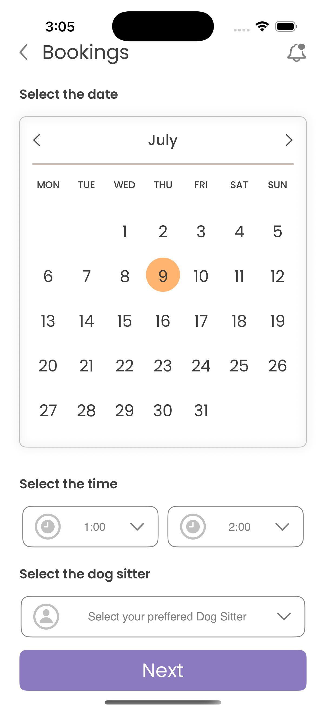

# 🐶 Dogo — Dog Walking & Pet Sitter Booking App

Dogo is an iOS app built with **SwiftUI** that connects pet owners with trusted dog sitters/walkers. Users can sign in, browse available dog sitters, schedule a walking/sitting session for their pet, track upcoming bookings, and get reminded before the sitter arrives — all backed by **Firebase**.

> "Where Every Walk is Tail-Wagging Fun!"

---

## 📱 Screenshots

| Splash | Sign In | Home | Booking |
|--------|---------|------|---------|
|  | _add screenshot_ | _add screenshot_ | _add screenshot_ |

| Schedule Booking | Booking List | Thank You | Side Menu |
|-------------------|--------------|-----------|-----------|
| _add screenshot_ | _add screenshot_ | _add screenshot_ | _add screenshot_ |

---

## ✨ Features

### Authentication
- **Email & password authentication** via Firebase Auth
- **Sign in with Google** using the Google Sign-In SDK
- **Sign in with Apple** using `AuthenticationServices`, with a SHA-256 hashed nonce (`CryptoKit`) for secure Firebase credential exchange
- Session persistence — the app automatically routes returning users straight to the Home screen based on Firebase's current auth state
- Auto-creation of a `users` Firestore document (username) on successful sign in
- Sign out from the side menu
- A Facebook button is present in the sign-in UI as a placeholder for a future Facebook Login integration (not yet wired to an SDK)

### Onboarding & Navigation
- Animated splash screen that transitions into the login card
- Custom side (hamburger) menu for navigating between Home, Bookings, Notifications, and Settings
- Tab-less navigation flow driven by SwiftUI `NavigationView` / `NavigationLink`

### Home
- Personalized greeting using the signed-in user's display name
- Search bar for finding sitters by name/location
- Promotional banner
- "Your next tour" card showing the most recent upcoming booking (sitter, location, time, date)
- Horizontally scrollable list of popular dog sitters pulled live from Firestore, including rating, hourly rate, and completed tour count
- Remote images loaded and cached with `SDWebImageSwiftUI`

### Booking
- List of the signed-in user's bookings grouped by month, fetched from Firestore in real time
- Empty state prompting the user to schedule their first booking
- **Multi-step booking flow**:
  1. Pick a date from a custom-built calendar (`CustomDatePicker` / `CalendarViewModel`)
  2. Pick a start & end time from a dropdown time picker
  3. Pick a preferred dog sitter from a dropdown populated from Firestore
- Overlap validation — prevents double-booking a time slot on the same date
- "Thank you" confirmation screen after a successful booking
- **Local push notification** automatically scheduled ~45 minutes before the booking's start time to remind the user their sitter is on the way (`UserNotifications` framework)

### Architecture & Quality
- Clean, testable `LoginViewModel` with a companion `TestLoginViewModel` used for UI/unit testing without hitting the network
- Centralized logging via `LogService` (built on Apple's unified `os.Logger`)
- XCTest unit test target (`DogoSwiftUITestAppTests`)

---

## 🏗 Architecture

The app follows the **MVVM (Model-View-ViewModel)** pattern layered on top of a lightweight clean-architecture-style folder structure:

```
DodoSwiftUITestApp/
└── App/
    ├── Domain/                # Plain data models — no framework/UI dependencies
    │   └── Models/
    │       ├── BookingModel.swift
    │       ├── DogSitterModel.swift
    │       ├── DateValue.swift
    │       ├── DropDownPickerState.swift
    │       └── SideMenuRowType.swift
    │
    ├── Infastructure/          # Cross-cutting services & utilities
    │   ├── Services/
    │   │   ├── AuthManager.swift      # Firebase Auth + Google + Apple sign-in
    │   │   └── LogService.swift       # Unified logging wrapper
    │   └── Utilities/
    │       ├── CurveShape.swift
    │       └── Extensions/
    │
    ├── Presentation/           # SwiftUI Views + ViewModels + Assets
    │   ├── ViewModel/
    │   │   ├── AuthenticationViewModel.swift
    │   │   ├── LoginViewModel.swift
    │   │   ├── HomeViewModel.swift
    │   │   ├── BookingViewModel.swift
    │   │   ├── BookingScheduleViewModel.swift
    │   │   ├── CalendarViewModel.swift
    │   │   └── CustomDatePickerViewModel.swift
    │   ├── Views/
    │   │   ├── SplashView.swift
    │   │   ├── MainTabbedView.swift
    │   │   ├── SideMenuMainView.swift
    │   │   ├── HomeView.swift
    │   │   ├── BookingView.swift
    │   │   ├── BookingScheduleView.swift
    │   │   ├── CustomDatePicker.swift
    │   │   ├── DropDownView.swift
    │   │   └── ThankyouView.swift
    │   └── Widgets/Assets/     # Asset catalog, fonts, images
    │
    ├── AppDelegate.swift
    └── DodoSwiftUITestAppApp.swift  # App entry point (@main)
```

**Data flow**: SwiftUI `Views` observe `@Published` state on `ObservableObject` `ViewModels`. ViewModels talk to `AuthManager` (a singleton wrapping `FirebaseAuth` + `Firestore`) to read/write data — Views never talk to Firebase directly.

---

## 🛠 Tech Stack

| Layer | Technology |
|---|---|
| UI | SwiftUI |
| Architecture | MVVM |
| Backend / BaaS | Firebase (Auth, Cloud Firestore) |
| Authentication | Firebase Auth (email/password), Google Sign-In SDK, Sign in with Apple (`AuthenticationServices` + `CryptoKit`) |
| Push/local notifications | `UserNotifications` framework (local), `FirebaseMessaging` included for future remote push support |
| Image loading & caching | `SDWebImageSwiftUI` |
| Dependency management | CocoaPods |
| Logging | `os.Logger` (via `LogService`) |
| Testing | XCTest |
| Language | Swift 5 |
| Minimum deployment target | iOS 17.0 |

### Key dependencies (`Podfile`)
```ruby
pod 'FirebaseAuth'
pod 'FirebaseFirestore'
pod 'GoogleSignIn'
pod 'SDWebImageSwiftUI'
pod 'FirebaseMessaging'
```

---

## 🔥 Firebase Data Model

| Collection | Purpose | Key fields |
|---|---|---|
| `users` | Basic profile info created at sign-in | `username` |
| `dogsitters` | Catalog of available sitters shown on Home & the booking flow | `name`, `rating`, `charges`, `profile` (image URL), `tours` |
| `bookings` | User's scheduled sessions | `date`, `startTime`, `endTime`, `sitter`, `userId` |

---

## 🚀 Getting Started

### Prerequisites
- macOS with Xcode 15+ installed
- [CocoaPods](https://cocoapods.org) installed (`sudo gem install cocoapods`)
- A Firebase project with **Authentication** (Email/Password, Google, Apple providers enabled) and **Cloud Firestore** set up

### Installation
```bash
# 1. Clone the repository
git clone <repo-url>
cd DogoAppSwiftUI-main

# 2. Install CocoaPods dependencies
pod install

# 3. Open the workspace (NOT the .xcodeproj)
open DogoSwiftUITestApp.xcworkspace
```

### Firebase configuration
1. Create a project in the [Firebase console](https://console.firebase.google.com).
2. Register an iOS app with bundle identifier `com.devsinc.DodoSwiftUITestApp`.
3. Download the generated `GoogleService-Info.plist` and replace the one at the project root.
4. Enable **Email/Password**, **Google**, and **Apple** sign-in providers under Firebase Authentication.
5. Create the `dogsitters` collection in Firestore and seed a few documents (`name`, `rating`, `charges`, `profile`, `tours`) so the Home screen has data to display.
6. In Xcode, add the **Sign in with Apple** capability to the app target and configure your Google `REVERSED_CLIENT_ID` URL scheme (from `GoogleService-Info.plist`) under **URL Types**.

### Run
Select the `DogoSwiftUITestApp` scheme and run on a simulator or device (iOS 17+).

---

## 🧪 Testing

Run the unit test target from Xcode (`Cmd+U`) or via CLI:
```bash
xcodebuild test -workspace DogoSwiftUITestApp.xcworkspace -scheme DogoSwiftUITestApp -destination 'platform=iOS Simulator,name=iPhone 15'
```

---

## 🗺 Roadmap / Ideas
- Wire up the Facebook sign-in button to the Facebook Login SDK
- Remote push notifications via `FirebaseMessaging` (dependency already included)
- Sitter profile detail screen & in-app chat
- Payments integration for bookings
- User-facing "Sign up" flow (currently the login screen only supports signing in to an existing account)
